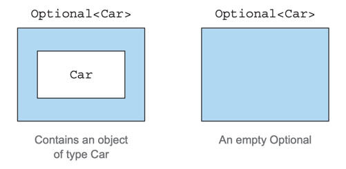

# 11. Using Optional as a better alternative to null

1. How do you model the absence of a value?
2. Introducing the Optional class
3. Patterns for adopting Optional
4. Practical examples of Optional
5. Summary

> ### This chapter covers
>
> - null reference의 문제점
> - null -> Optional : null-safe한 방법으로 변경하기
> - null check 코드 없애기
> - Optional을 읽는 방법
> - 값이 누락 될 수 있는 상황

---

- `NullPointerException`은 가장 많이 접하는 Exception 중 하나
- Tony Hoare가  **_the absence of value_** 를 표현하기 위해 null을 도입했지만, 이는 많은 문제를 야기

## 1. How do you model the absence of a value?

```
return idol
    .getMember() // nullable
    .getCar()    // nullable
    .getName();  // nullable
```

<details><summary>Idol, Member, Car</summary>

```java
public class Idol {
    private Member member;

    public Member getMember() {
        return member;
    }
}

public class Member {
    private Car car;

    public Car getCar() {
        return car;
    }
}

public class Car {
    private String name;

    public String getName() {
        return name;
    }
}
```

</details>

### 1.1 Reducing NullPointerExceptions with defensive checking

```
// deep doubt
if(idol != null) {
    Member member = idol.getMember();
    if(member != null) {
        Car car = member.getCar();
        if(car != null) {
            return car.getName();
        }
    }
   return "Unknown";
}

// too many exits
if(idol == null) {
    return "Unknown";
}
Member member = idol.getMember();

if(member == null) {
    return "Unknown";
}
Car car = member.getCar();

if(car == null) {
    return "Unknown";
}
return car.getName();
```

- 가독성이 떨어짐
- error-prone : 특정 필드 체크를 잊을 수 있음

### 1.2 Problems with null

- **_source of error_** : Java의 가장 흔한 Exception
- **_bloats your code_** : null check 코드가 많아짐
- **_meaningless_** : null reference는 의미가 없음
- **_breaks Java philosophy_** : Java는 pointer를 숨기지만 null pointer는 그렇지 않음
- **_creates a hole in the type system_** : null은 모든 타입에 참조 가믕

### 1.3 What are the alternatives to null in other languages?

````groovy
def idolMemberCarName = idol?.member?.car?.name ?: "Unknown"
````

- `?.` : **_safe navigation operator_**
- NPE 없이 null-safe하게 코드 작성 가능
- chain에서 null 이 있으면 `null`을 반환

#### Haskell, Scala

- Haskell `Maybe` 타입 : optional value를 캡슐화
- Scala `Option[T]` : `T` 타입의 optional value를 캡슐화
    - `Option`의 value가 존재하는지 체크를 의무화

## 2. Introducing the Optional class



- Haskell, Scala로부터 영감을 받아 추가한 `java.util.Optional<T>` class
- optional value를 캡슐화
- value가 있으면 `Optional`이 wrapping, 없으면 `Optional.empty()` 반환
- null reference vs `Optional.empty()`
    - null reference : NPE 유발
    - `Optional.empty()` : `Optional` 객체 반환
- 가독성 :  명시적으로 객체가 optional임을 표현

````java
public class Idol {
    private Optional<Member> member; // optional

    public Optional<Member> getMember() {
        return member;
    }
}

public class Member {
    private Optional<Car> car; // optional

    public Optional<Car> getCar() {
        return car;
    }
}

public class Car {
    private String name; // not null

    public String getName() {
        return name;
    }
}
````

## 3. Patterns for adopting Optional

## 4. Practical examples of Optional

## 5. Summary